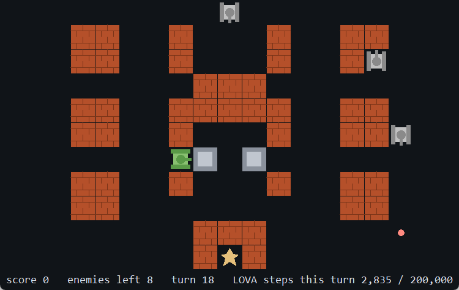
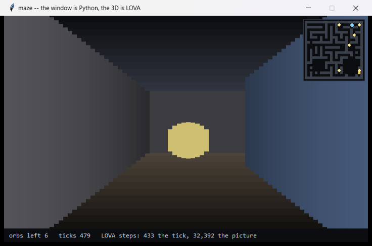
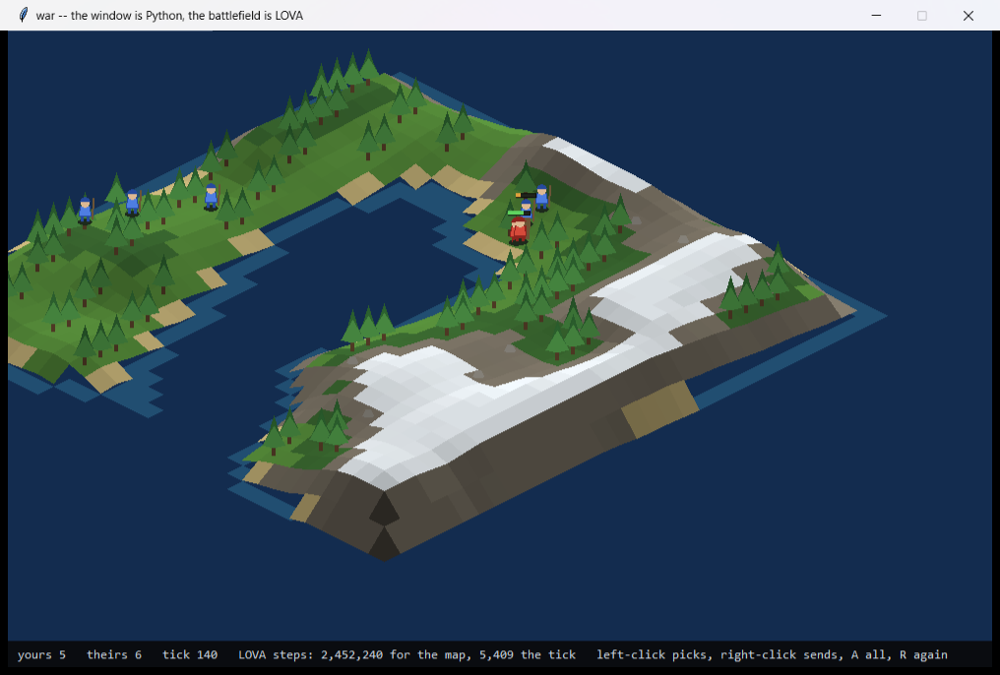
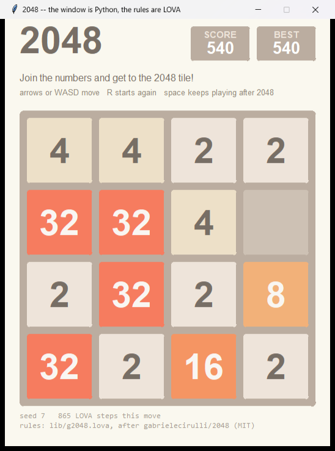
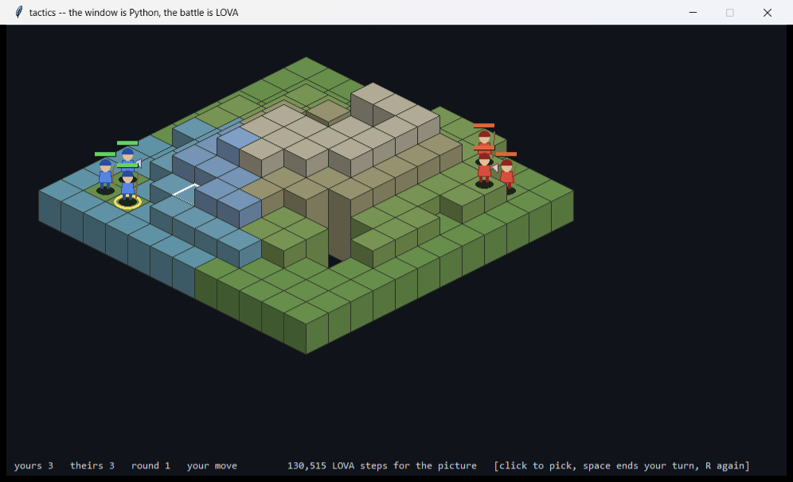
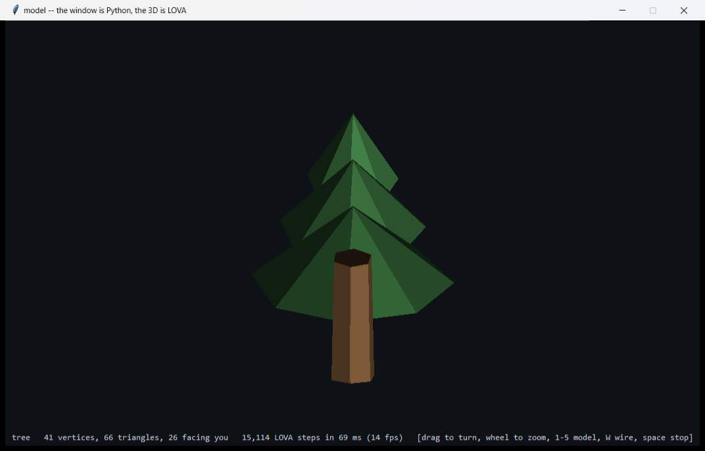
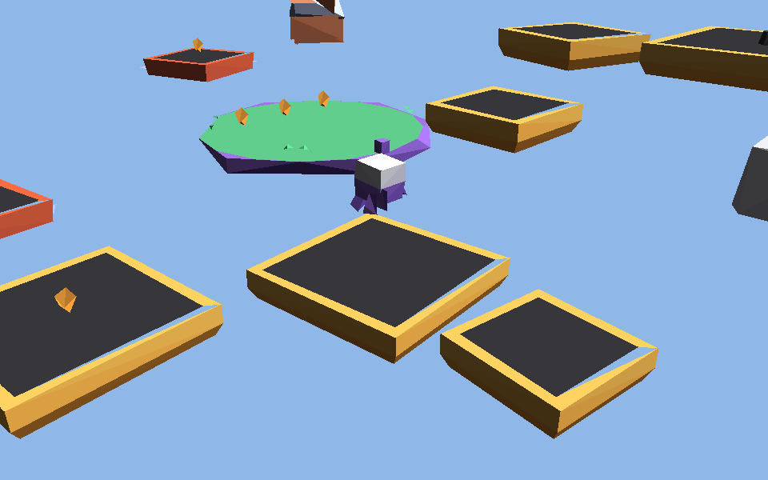
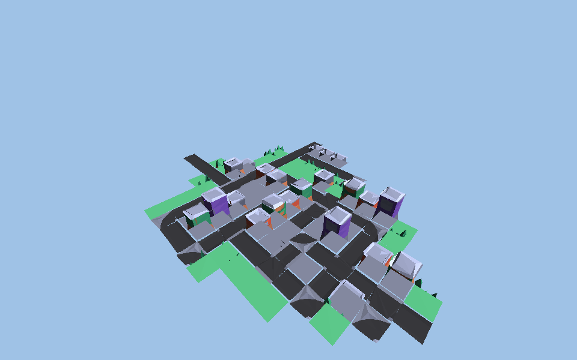
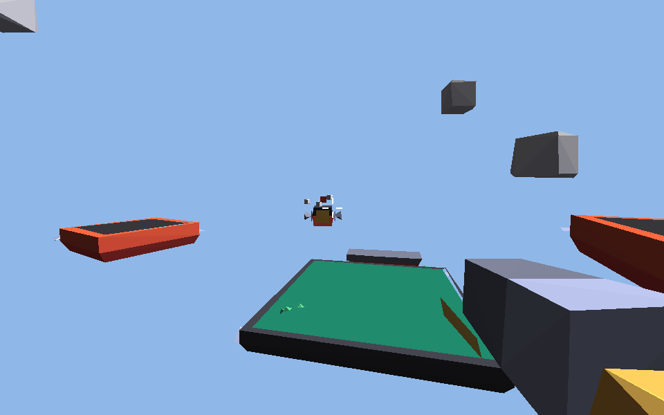
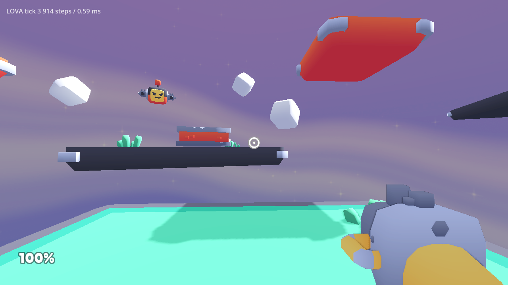

# LOVA

**An AI-native integer-sequence programming language.**

*Status: **1.0 — the language is complete, and initially usable.**
All ten design axioms are realised inside the language and measured by
an experiment. The 64-operator table is spent (63 operators and `END`):
integers, lists, strings, closures, `letrec`, loops, error handling
that can catch and raise, programs as values with lineage, populations
that evolve, file / clock / network IO under declared capability
boundaries, and a persistent map. There is a compiler with five static
passes, a type-constrained generator, a standard library written in
LOVA, modules, a CLI, an MCP server for agents, and 1 104 tests. The
reference implementation is a stdlib-only Python interpreter; the
programs run on a native Rust runtime -- a bytecode VM at 10-12
million steps a second, checked against the interpreter step for step
on a golden set of 1 023 records -- which is the default, and the same
runtime loads into Godot 4 as an extension class, so a game's rules can
be LOVA under the engine's own picture. It has no floats, no namespaces
and no concurrency. The "What LOVA still cannot do" section below is
kept honest.*

## The one-paragraph pitch

LOVA has one goal: **an AI uses it more conveniently than any other
language.** Not denser, not stranger: fewer attempts from writing to
running, less context spent on each failure, no scaffolding needed to
run the code safely, and code that can be reused, repaired and traced
by the program that comes after it. The error model, the contracts, the
declared effects, the lineage and the evolution machinery exist for
that; the integer encoding underneath is the format and the identity
of a program, not the point. **AI is the first-class reader, writer,
and executor** -- and the people who work with it are the second.

```lova
(defn square [n] (⊗ n n))
(square 7)
```

...is a Stage-1 *projection*. The program itself is an integer sequence;
the text is a pretty-printer over it. `⊗` is `mul`, `defn` desugars to
`let` + `lambda`, and the call desugars to `apply` — so what the
substrate stores is:

```lova
(let 0 (lambda 1 (mul (ref 1) (ref 1))) (apply (ref 0) 7))
```

Identifiers are interned to integer name ids at parse time and printed
back as integers, because the integer is the program (Axiom 1). Every
form above compiles to the existing 64 operators; the sugar adds no
semantics.

## Three stages

| Stage | Surface | Status |
|---|---|---|
| **1 — Text-surface LOVA** | Lisp-like s-expressions compiling 1:1 to tokens | **current**, and now audit-oriented |
| **2 — AI-primary LOVA** | one character per byte, no delimiters (`core/surface2.py`) | **surface built and measured** (Exp 14); fine-tuned model still M8 |
| **3 — Pure-AI LOVA** | no text; programs are integer sequences, humans read via `(explain program)` | north star |

## What's actually implemented

- **64-token core ISA** (8 families × 8), 1 byte per operator — 52 operators
  have runtime semantics, 12 are reserved (`spec/tokens.md`, generated
  from the table by `spec/generate_tokens_md.py`)
- **Data** — one cons cell (`nil` / `cons` / `head` / `tail` / `nil?`)
  gives pairs, lists, and strings as codepoint lists, so `"abc"` is
  surface sugar and costs the token table nothing (`spec/token-budget.md`)
- **Two surfaces** — Stage 1 s-expressions for authoring and audit, and
  the Stage-2 projection of the byte encoding for density: one character
  per byte, no delimiters, lossless in both directions
  (`core/surface2.py`)
- **IO** — `stdout` / `stdin`, the first operators that touch the world;
  the only non-determinism in the language, and `static_analyze` reports it
- **A standard library written in LOVA** — `lib/prelude.lova`: `map`,
  `filter`, `fold`, `range`, `append`, `reverse`, `digits`, `println` and
  the rest, none of them builtins. Free to include: the compiler's
  `drop-unused` pass takes a program that calls none of it from 474 nodes
  back to 1
- **A command line** — `lova run | repl | emit | analyze | mcp`
  (`core/cli.py`)
- **An MCP server** — `lova mcp` serves `lova_execute`,
  `lova_static_analyze`, `lova_valid_next` and `lova_emit` to any
  Model-Context-Protocol host over stdio, with no dependency outside the
  standard library; `lova_valid_next` is Axiom 3 as a service
  (`core/mcp_server.py`)
- **One error model, reachable from inside** — every fault carries the
  same structured anomaly, and `(when-anomaly body handler)` hands a
  program the anomaly's code so it can recover. The substrate's
  termination ceiling is the one thing a program cannot mask
- **Populations** — Axiom 6 in the language: `(defpop scorer p1 p2 …)`
  builds a pool, `(evolve pop)` runs a generation with the same rule the
  Python engine used, `(select pop 0)` is the fittest, and the winner
  can say where it came from. Exp 15 re-runs the self-healing experiment
  as one LOVA program
- **Programs as values** — `quote` / `eval`, and the whole Meta family:
  `(explain p)` renders a program as text, `(hash p)` gives its integer,
  `(why p)` / `(lineage-query p)` / `(ancestor-of a b)` ask where it
  came from, `(clone p)` / `(mutate p 30)` derive one and record how,
  and `(read text)` is `explain`'s inverse, so a program can build a
  program from text and `eval` it. Axiom 5 is now true inside the
  language, and Stage 3's `explain` exists
- **The world, declared** — `(boundary "fs-read clock" body)` says
  which effects `body` may use; `fs-read` / `fs-write` / `clock` are
  the effects. The compiler refuses a use outside a boundary that
  declares it, the runtime refuses a boundary the host did not grant
  (`lova run --allow fs-read,clock`), nothing is granted by default,
  and a generated program cannot use the world without declaring it.
  The network is `net-send` / `net-recv` over UDP datagrams: the
  program declares the kind, the host names the places (`--allow
  net=host:port`, `net=:port`). Axiom 4, for effects that touch the
  world
- **A standard library a program can stand on** — lists that iterate
  rather than recurse (`len` / `map` / `filter` / `fold` / `sort` /
  `take` / `zip` ...), text (`words` / `lines` / `split` / `join` /
  `parse-int` / `text-of`), a persistent **map** (`map-put` /
  `map-get` / `map-pairs`, keys integers or text), and `signal` so a
  library can raise the structured anomaly its callers can catch.
  `apps/wordfreq.lova` is the acceptance program (M22)
- **Libraries** — `(use "evolution")` includes `lib/evolution.lova`,
  where a custom evolution rule is nine lines over the six Evolution
  operators; `(use "prelude")` is the standard library, loaded by the
  CLI by default. Inclusion is textual, once, and free after
  `drop-unused`
- **Abstraction** — unary closures with currying, `letrec`, and a loop
  combinator, so recursion and unbounded iteration are expressible.
  Two always-on ceilings (`MAX_CALL_DEPTH`, `MAX_STEPS`) turn
  non-termination into a structured anomaly rather than a hang
  (`core/runtime.py`)
- **Type-directed generation** — for any partial program the set of
  well-typed next tokens is computable, so ill-typed programs are not
  representable (`core/types.py`, `core/generator.py`)
- **Conservation as a type** — budget/effect bounds live in the signature;
  violations are compile errors or runtime Δ-traps (`core/conservation.py`)
- **Surprise instead of stack traces** — deviations surface as structured
  anomalies; the Δ-trap scanner pinpoints the deepest offending
  sub-expression *and* the correction value (`core/runtime.py`)
- **Lineage** — every artifact carries provenance, queryable in-language
  (`core/lineage.py`)
- **Populations** — a function is a pool of competing variants, not a
  single definition (`core/populations.py`)
- **Compiler** — scope-check, type-check, constant-fold passes; compile
  errors share the runtime anomaly schema so an agent has one error
  handler (`core/compiler.py`)
- **LOVABench** — 60 tasks / 180 cases across 5 categories, with a
  reference evaluator (`corpus/`). Note: every task predates M9, so
  none of them exercises recursion or iteration (Q33).

## Quick start

Requires Python ≥ 3.10. The core has **no dependencies**, so it also
runs under PyPy. With Rust installed, `cargo build --release` in
`native/lova-rt` builds the native runtime -- 10-12 million steps a
second, twenty times CPython -- and `lova run` uses it by itself for every program it
implements (`--native off` for the Python runtime, `--native on` to be
told why it could not be used): the same values, the same anomalies,
the same step counts, checked record by record against
`corpus/golden/`. The compiled program is cached under `$LOVA_CACHE`,
or `%LOCALAPPDATA%\lova\cache` on Windows and `~/.cache/lova`
elsewhere, keyed by the source, the libraries it uses and a hash of
the implementation, so a second run of a program that pulls in one of
the 3D libraries skips a parse that costs one to two seconds;
`LOVA_CACHE=off` disables it.

```bash
git clone <this-repo> lova && cd lova
export PYTHONPATH="$PWD"

# run a program
python -m core.cli run apps/is_prime.lova 1999      # => 1
python -m core.cli run apps/palindrome.lova racecar # => 1
python -m core.cli run apps/palindrome.lova 's="7"'  # a quoted argument is a text, even "7"

# play noughts and crosses against a negamax that never loses
python -m core.cli run apps/tictactoe.lova 0

# run untrusted programs, one per line, under a budget; report each by name
python -m core.cli run apps/sandbox.lova 5000 < programs.txt

# evolve a pool of programs toward a target and ask the winner why it exists
python -m core.cli run apps/evolve.lova 42 60

# repair a program that violates its contract, guided by surprise
python -m core.cli run apps/repair.lova 42 30 200

# a Python web shell whose only decision is a LOVA rule you can edit and break
python apps/shell/policy_app.py       # http://127.0.0.1:8765

# tank battle: the window is Python, every rule of the game is LOVA
python apps/tanks/tank_game.py        # arrows move, space fires
python -m core.cli run apps/tanks.lova 7   # the same game, turn by turn in the terminal
python apps/maze/maze3d.py            # a first-person 3D maze, cast in integers
python apps/war/war.py                # an isometric battlefield, terrain and all
python apps/g2048/game2048.py 7       # 2048, ported from gabrielecirulli/2048
python apps/tactics/tactics.py        # a tactics battle, ported out of GDScript
python apps/model/model.py            # low-poly meshes, turned and lit in real time
python apps/platformer/platformer.py  # Kenney's 3D platformer kit, ported out of GDScript
python apps/citybuilder/citybuilder.py # Kenney's city builder kit, sample city and all
python apps/fps/fps.py                # Kenney's FPS kit: two blasters, four flying enemies
#   the three 3D kits above draw in an SDL window when pygame is there
#   (`pip install pygame` for the smooth window; Tk is the fallback, and
#   `--host tk` / `--host sdl` chooses.  `--bench N` prints frame times)
python -m core.cli run apps/cube.lova # a cube turning in three dimensions

# an interactive session, with the standard library loaded
python -m core.cli repl

# see a program as the Stage-2 surface, as bytes, or as one integer
python -m core.cli emit apps/coprime.lova 14 15 --form stage2
python -m core.cli emit apps/coprime.lova 14 15 --form int

# what will this program do, without running it
python -m core.cli analyze apps/collatz.lova 27

# run the examples a program declares about itself
python -m core.cli check apps/tictactoe.lova 0

# run the test suite (1 104 tests, stdlib unittest only)
python -m unittest discover -s tests

# the same under PyPy, where the whole suite is also expected to pass
pypy -m unittest discover -s tests -t .

# run an experiment
python experiments/experiment_01_hello_lova.py

# the per-app Python drivers still work, and print the whole pipeline
#   (parse → analyse → compile → encode → evaluate)
python apps/is_perfect.py 28
```

Or install it — the wheel ships the core, the LOVA libraries and the
corpus, and puts a `lova` command on the path:

```bash
pip install .
lova run apps/is_prime.lova 1999
```

### Give it to an agent

`lova mcp` speaks the Model Context Protocol on stdin/stdout. Any MCP
host — Claude Code, Claude Desktop, Cursor — gets four tools: run a
program (with explicit capability grants), analyse one without running
it, ask which tokens may come next in a partial program, and project a
program into Stage 2 / bytes / one integer.

```json
{"mcpServers": {"lova": {"command": "lova", "args": ["mcp"]}}}
```

From a checkout without installing: `"command": "python", "args":
["-m", "core.cli", "mcp"], "cwd": "/path/to/lova-lang"`.
`apps/mcp_demo.py` drives the server through its pipes and calls each
tool once.

All 14 experiments run. Exp 03 and Exp 07 had been dead since the
corpus grew from 20 tasks to 60; they were fixed at M13 and their
numbers below are the 60-task ones.

Experiment 11 additionally needs `tiktoken`:

```bash
pip install -e ".[experiments]"
```

## What the programs show

Twenty-three programs in `apps/`, each written to use the language for
something and kept as a test. What they demonstrate:

- **It runs a game.** Tank battle, in real time: eight enemies arrive
  along the top of the grid, wander until they see you or your base
  down a clear line, and shoot. Every rule -- movement, walls a bullet
  breaks, the enemies' aim, spawning, the win -- is `lib/tanks.lova`,
  about 250 lines of pure functions over one world record, carrying
  eighteen examples of itself that `lova check` runs. The window is
  tkinter and owns nothing but the pixels and the keys: ten times a
  second it hands the LOVA program the world and the key you hold, gets
  the next world back, and paints it. A turn costs about 10 000 steps
  under a budget of 200 000, shown in the corner, and a rule that ran
  away would be a structured anomaly on the screen rather than a frozen
  window. The same rules play turn by turn in a terminal.

  

  ```bash
  python apps/tanks/tank_game.py             # arrows move, space fires, R restarts
  python -m core.cli run apps/tanks.lova 7   # the terminal
  ```

- **It renders 3D.** A first-person maze: eighty rays a frame, cast
  through a 23-by-23 grid, each marched cell by cell until it meets a
  wall, and the wall drawn as tall as its distance says. LOVA has no
  floating point, so every number in it is an integer -- lengths in
  1024ths of a cell, angles in 256ths of a turn, a sine from a
  65-entry table, a square root by Newton's method for the round edge
  of an orb. The picture is one call, `(frame w 80 420)`: a list of
  columns, each with a height, a wall and a distance, and the orbs
  already tested against the wall in front of them. It costs about
  35 000 steps, under a tenth of a second, and the window is tkinter
  with nothing in it but the painting and the keys. `apps/cube.lova`
  is the other kind of 3D on the same arithmetic -- eight corners, a
  rotation about two axes, a perspective divide -- drawn in characters
  in a terminal.

  

  ```bash
  python apps/maze/maze3d.py                  # W/S walk, A/D turn, Q/E sidestep
  python -m core.cli run apps/maze.lova 0     # the same maze, drawn in characters
  python -m core.cli run apps/cube.lova       # a cube turning in three dimensions
  ```

- **And the camera a strategy game uses.** An isometric battlefield:
  a height field from value noise, an island falloff, water at sea
  level, sand, grass, upland, rock and snow chosen by height and slope,
  woods and boulders where the ground is flat enough, and a sun dotted
  against every cell's normal over its own length for the light. Then
  twelve soldiers on top of it, who walk, slide along a coast they
  cannot cross, fight what comes within reach and die of it. All of it
  is `lib/war.lova`: 1 296 cells and 2.5 million steps for the ground,
  handed to the host far cells first because a painter has no depth
  buffer, and about 6 000 steps a tick for the battle. The window
  owns the pixels, the clock and the mouse, and nothing else.

  

  ```bash
  python apps/war/war.py    # left-click picks, right-click sends, drag pans, A all, R again
  ```

- **It ports someone else’s game, and proves it.** 2048, after
  [gabrielecirulli/2048](https://github.com/gabrielecirulli/2048) (MIT):
  `lib/g2048.lova` was written against the original’s
  `js/game_manager.js` — the same traversal order, the same
  farthest-position walk, the same rule that a tile made this move
  cannot merge again, the same score, the same nine-in-ten chance of a
  two. The claim that a port behaves like its original is not made in
  prose: `tests/test_2048.py` holds a transliteration of the original
  in Python and runs both over random positions, comparing the board
  cell by cell. **10 000 positions, no disagreement.** One difference
  on purpose — the original’s chance is `Math.random` and cannot be
  replayed; here the generator is threaded through the world, so a seed
  is a game. The port also found a real bug in our own compiler, in
  what `drop-unused` does with a binding kept for its effects.

  

  ```bash
  python apps/g2048/game2048.py 7            # the window, in the original's colours
  python -m core.cli run apps/g2048.lova 7   # the terminal
  ```

- **And a game engine’s rules, ported out of GDScript.**
  [ramaureirac/godot-tactical-rpg](https://github.com/ramaureirac/godot-tactical-rpg)
  (MIT, ~960 stars) is a Final-Fantasy-Tactics-shaped demo for Godot 4.
  Its rules are now `lib/tactics.lova`: the breadth-first flood a pawn’s
  movement makes across blocks it can climb, the marking of reachable
  and attackable tiles, damage that is the attacker’s power and nothing
  else, an opponent that walks to the tile beside the nearest of yours
  and strikes the weakest thing in reach. `tests/test_tactics.py` holds
  a transliteration of the original’s flood and compares the distance
  to **every cell of the arena, for every kind of pawn**. Two places
  where the original contradicts itself are named in the file header
  rather than quietly copied or quietly fixed. **The arena and the cast
  are the original’s too**: its scene file holds no model — every
  “mesh” in it is a one-by-one quad with the height in the node’s
  transform — so the layout was read out of it, two hundred tiles on
  ten by twenty, and its seven character sprites sit in
  `apps/tactics/assets/` under its MIT licence. What is ours is the
  renderer: Godot draws with a GPU; this is isometric blocks the host
  paints from a list LOVA hands it, far ones first.

  

  ```bash
  python apps/tactics/tactics.py   # click one of yours, space ends your turn
  ```

- **And a mesh, in real time.** `lib/mesh3d.lova` is the general camera:
  a model of triangles with no grid under it, turned about two axes,
  divided by its depth, back faces dropped by the sign of the projected
  area, each face lit by its own normal, handed over far face first. No
  square root anywhere — a face keeps the unit normal it was born with,
  and a rotation does not change a length — and the sun is carried into
  the model’s frame once a frame rather than every normal into the
  camera’s. About **220 LOVA steps a triangle**: 32 triangles in 16 ms,
  48 in 25, 66 in 31, and a 320-triangle sphere in 139. `tests/test_mesh3d.py` holds the same renderer in
  floating point and compares 961 faces across five models and five
  angles: **the fixed-point picture lands within 1.34 pixels of it**,
  with the same faces surviving the cull.

  

  ```bash
  python apps/model/model.py                        # 1-5 pick a model, drag to turn
  python apps/model/obj_to_lova.py mine.obj lib/mine.lova mine   # what Blender exports
  ```

- **And a 3D platformer, ported from Kenney's starter kit.**
  `lib/platformer.lova` holds the rules of
  [KenneyNL/Starter-Kit-3D-Platformer](https://github.com/KenneyNL/Starter-Kit-3D-Platformer)
  (MIT, about 1 200 stars), written against its GDScript: the character
  that walks, jumps twice and squashes when it lands, the coins that
  bob and spin, the platforms that give way, the bricks broken from
  below, the camera that follows, turns and zooms, and the fall off the
  world that starts everything again — every constant the kit's own.
  `lib/scene3d.lova` puts the kit's models into one picture under a
  camera that moves: forty-six objects placed, turned, tilted, culled
  and lit, about **4 000 LOVA steps a tick and 150 000 a frame**. The
  models and the level are the kit's, read out of its `.glb` files and
  its scene by `apps/platformer/import_kit.py` and decimated to a
  budget each with the paint kept where it was. `tests/test_platformer.py`
  transliterates the kit's five scripts and runs them beside the port
  one tick at a time over a scripted play: **every position within four
  thousandths of a metre**, the same coins taken, and the fall off the
  world on the same tick.

  

  ```bash
  python apps/platformer/platformer.py                   # WASD, space, arrows, +/-
  python apps/platformer/platformer.py --shot out.png    # one frame, no window
  ```

- **And a city builder, from Kenney's other starter kit.**
  `lib/citybuilder.lova` holds the rules of
  [KenneyNL/Starter-Kit-City-Builder](https://github.com/KenneyNL/Starter-Kit-City-Builder)
  (MIT, about 1 500 stars): a grid of fifteen kinds of structure, a
  till charged only when a cell changes hands, a cursor that turns in
  quarters, a camera that pans, turns under the mouse and zooms in
  steps — and what a click *means*, the mouse carried back through the
  camera to the ground in integers. The sample city ships with it: 122
  cells and the 5 860 left in its till, read out of Godot's binary
  resource format by `apps/citybuilder/import_kit.py`, which also
  reads the fifteen models and simplifies them by vertex clustering.
  `tests/test_citybuilder.py` transliterates `builder.gd` and
  `view.gd` and runs them beside the port one tick at a time through a
  session of panning, turning, zooming, building over and demolishing:
  **the same till, the same cells, the same camera within four
  thousandths**, and the same cell under the mouse for every pixel not
  within eight hundredths of a boundary.

  

  ```bash
  python apps/citybuilder/citybuilder.py                 # WASD, wheel, middle-drag, click, Q/E
  python apps/citybuilder/citybuilder.py --empty         # a clean grid
  ```

- **And a first-person shooter, from Kenney's third starter kit.**
  `lib/fps.lova` holds the rules of
  [KenneyNL/Starter-Kit-FPS](https://github.com/KenneyNL/Starter-Kit-FPS)
  (MIT, about 1 000 stars): a player who walks at five, jumps twice,
  looks with the mouse and fires two blasters whose cooldown, spread,
  shot count and knockback are the kit's own resources; four flying
  enemies that hover on a cosine, turn to face him and fire a
  five-metre ray every quarter second; a ray test against spheres and
  boxes in integers; a fall off the world that starts again. The
  picture is seen from the eye: `lib/scene3d.lova` gained a
  first-person camera, and the weapon is held where the kit's second
  camera holds it, by the ratio of the two fields of view.
  `tests/test_fps.py` transliterates `player.gd`, `enemy.gd` and the
  two weapon resources and runs them beside the port for 642 ticks of
  a scripted play -- walking, looking, jumping the gap, emptying both
  blasters into an enemy, taking fire, sliding along a wall, falling
  off: **the same position within four thousandths, the same yaw,
  pitch, health, cooldown and enemies, tick for tick**. On the native
  runtime a tick is 2 ms and a frame 8 ms, and the SDL window holds
  60 frames a second (`apps/fps/README.md` has the table); a run on
  both runtimes draws the same picture to the byte.

  

  ```bash
  python apps/fps/fps.py                                 # WASD, space, mouse, E, left button
  python apps/fps/fps.py --shot out.png                  # one frame, no window
  ```

- **The same rules, inside Godot.** `native/lova-godot` is the native
  runtime as a Godot 4 extension class, and `apps/godot/fps` is the
  kit's own Godot project with `player.gd` and `enemy.gd` replaced by
  scripts that call `lib/fps.lova` once a physics tick and put the
  answer into the kit's nodes. Godot draws its own scene -- the sky,
  the models, the muzzle flashes, the impact sprites, the HUD -- and
  LOVA decides everything that happens in it, in 0.6 ms a tick.
  **[A seven-second recording](apps/godot/fps/demo.mp4)** (with the
  sound), made by `build.py --movie`, shows the demo walk in, look
  round and take three of the four enemies with both weapons; the
  corner reads the rules' cost every tick.

  

  ```bash
  cargo build --release --manifest-path native/lova-godot/Cargo.toml
  python apps/godot/fps/build.py path/to/Starter-Kit-FPS --run     # play it
  python apps/godot/fps/build.py --movie=demo.mp4                  # record the demo
  ```

- **Logic runs right the first time.** The word count, the games, the
  log summary, the batch, the sandbox: every program's logic produced
  the correct result at its first execution. Errors, when they came,
  were caught at compile time with a repair hint, or reported at run
  time as a structured anomaly, never as a crash or a traceback.
- **Failure is data.** The sandbox runs untrusted programs, one per
  line, and reports each by hash and value or by the *name* of its
  fault: an infinite loop meets its `budget`, a file read meets the
  boundary it did not declare, text that is not a program is said to
  be one. Nothing reaches the sandbox, and the sandbox needs no grant.
- **Contracts are the program's own.** The batch gives each job its
  own budget and counts the jobs that exceeded it; the repairer states
  a `conserve` contract and mutates the patient until it holds,
  keeping only mutations that shrink the surprise. 219 of 300 jobs
  finish under budget, exactly as an outside computation predicts;
  three repair targets converge in 39, 37 and 20 attempts,
  reproducibly.
- **Provenance is queryable from inside.** The evolved winner and
  the repaired program each print their text, their generation, why
  they exist and the length of their descent, with no help from
  Python.
- **The world is declared.** Two processes exchange datagrams, a file
  is read, the clock is consulted, each under a boundary that names
  the kind of effect while the host names the places. A program that
  did not declare an effect cannot reach it, and the compiler says so
  before the run.
- **Programs are integers.** Every one of the programs, re-run from its
  Stage-2 projection, gives the identical output and value, the
  3 000-character game included.
- **A model writes it from one page.** A fresh Claude session given
  `corpus/language_card.md` and the 80 tasks of LOVABench v3, one
  answer each and no execution, wrote **79 of 80 correct**, exactly
  its score in Python on the same tasks; the algorithmic category was
  20 of 20 in both. The language costs a model nothing to write, and
  gives its programs contracts, budgets and structured faults Python
  does not have (`journal/experiment_17.md`).
- **A model fixes it from the fault.** In a loop where a fresh session
  runs its code and reads what came back, ten tasks with loops, lists
  and text: all ten correct in both languages, LOVA in eleven
  submissions, Python in ten. The one LOVA miss came back as a compile
  fault with the excerpt, the line, and the replacement to write; the
  next submission passed. The LOVA answers ran as a function call
  under a budget with nothing granted; the Python answers needed a
  subprocess and a timeout (`journal/experiment_18.md`). On eight
  bigger tasks with three sessions per language, every compile fault
  a session met was fixed at its next submission, and the sessions
  called the diagnostics "excellent"; a step budget now reports which
  functions it went to (`journal/experiment_19.md`).
- **It runs anywhere Python does, and fast where Rust does.** The core
  has no dependencies, so the same programs run under CPython and PyPy,
  and the 1 104 tests pass on both; the native runtime runs the same
  byte sequence at 10-12 million steps a second and inside Godot.
- **Text is a value.** A string literal is one node; `words`, `split`,
  `join`, `parse-int` and the rest are one operator each; a word count
  of 10 000 lines runs in 5.5 s on CPython where it took 28 (M25).
- **A fault says where, and a fix is a patch.** Every anomaly carries
  the source span of the expression at fault and its text; the MCP
  server's `lova_patch` replaces that span -- or a text inside a named
  def -- and checks the result. A failed `example` names the single
  edit that makes it pass, with the replacement. The loop an agent runs
  is execute, patch, execute, and a fix costs the size of the fix.
- **A program answers questions instead of being read.** `lova_show`
  gives one def by name with its span and parameters, `lova_scope` what
  is bound at a point, `lova_callers` who calls whom -- so an agent
  reads the def it asked about, not the file.
- **What the programs found was fixed the same day.** Writing them
  surfaced four edges -- in input, in self-reference, in program ids,
  in arguments -- and each became a compile-time check, a prelude
  function or a command-line form before the day ended, with a test
  for every shape. The journal keeps the record.

## Where LOVA fits

Every language has a place. Python is the glue and the notebook, Rust
the systems layer, JavaScript the browser, Erlang the switch that never
goes down. LOVA's place is **code that an AI writes, a machine runs, and
a person need not read**: the small programs agents produce all day,
the rules and policies a system lets its users or its models change,
the routines a long-running service tunes by itself. What it gives that
place is a set of guarantees no general-purpose language carries.

### Against other languages

| What a program gets | Python | Rust | Haskell | Clojure | Unison | **LOVA** |
|---|:-:|:-:|:-:|:-:|:-:|:-:|
| Faults as structured data, not text | – | partly | partly | – | – | **yes** |
| Ill-formed programs unrepresentable to a generator | – | – | – | – | – | **yes** |
| Effects declared by the program, granted by the host | – | – | typed | – | partly | **yes** |
| Termination guaranteed | – | – | – | – | – | **yes** |
| Cost contracts inside the program | – | – | – | – | – | **yes** |
| Programs as first-class data | – | – | – | yes | yes | **yes** |
| Provenance queryable from inside | – | – | – | – | partly | **yes** |
| A function as an evolving population | – | – | – | – | – | **yes** |
| Repair guided by the program's own deviation | – | – | – | – | – | **yes** |
| Zero dependencies, one core on CPython and PyPy | core | – | – | JVM | runtime | **yes** |

How LOVA does each, in the order of the table:

1. Every fault carries a kind, a position path and a repair hint, at
   compile time and at run time alike; `when-anomaly` lets a program
   catch its own and branch on the code.
2. `valid_next` gives the legal next tokens at every step, so a
   generated program cannot be syntactically or scope-invalid.
3. `(boundary "fs-read" ...)` declares the kind of effect, `--allow`
   names the places; an undeclared effect is a compile error.
4. Step and depth ceilings are built in: a loop that never ends is a
   structured anomaly, never a hang, and a run over budget names the
   functions the steps went to.
5. `(budget n ...)` per call, per job, per untrusted line; the program
   catches its own overrun.
6. `quote`, `eval`, `read`, `explain`, `hash`: a program is one
   integer, and a value the language handles.
7. `why`, `generation`, `lineage-query` are operators; the record is in
   the value, not in a side channel.
8. `defpop`, `evolve`, `select`: the winner explains its descent.
9. `conserve` states the contract, `surprise` measures the miss,
   `mutate` proposes; three targets repaired in 39, 37 and 20 attempts,
   reproducibly.
10. The core is stdlib-only; 1 104 tests pass on both interpreters.

And the measurement behind the claim that it costs a model nothing: a
fresh Claude session given one page of LOVA wrote 79 of 80 benchmark
tasks correctly, single-shot, exactly its score in Python.

Three of these exist elsewhere, scattered: effects in types (Haskell,
Koka), code as data (Lisp, Unison), a system that heals itself
(Erlang). None of them has all three, and none has the other seven.
LOVA is the language where they meet, in 64 operators.

### Scenarios

**The agent's sandbox.** An agent that works needs to compute
constantly -- a sum, a transform, a check -- and today it writes Python
into a container. In LOVA the program cannot hang, cannot touch a file
or the network it did not declare, and reports every failure as data.
`apps/sandbox.lova` runs untrusted programs one per line, under a
budget, reporting each by digest and value or by fault name, and is
itself twelve lines of LOVA needing no grant. The MCP server (`lova
mcp`) serves this to any host.

**The rule layer of an application.** Interface, storage and network
in the language you already use; the one piece that *decides* -- a
pricing rule, a policy, a user's or a model's script -- in LOVA, edited
live, run under a budget with no capability, and unable to hurt the
application that hosts it. `apps/shell/policy_app.py` is a Python web
shell whose only decision is a LOVA rule you can edit and break in the
browser; `apps/tanks/tank_game.py` is a tank battle whose every rule --
movement, bullets, the enemies' aim, the win -- is `lib/tanks.lova`,
called ten times a second from a Python window that owns nothing but
the pixels and the keys.

**Generated code that must be auditable.** A program is an integer
that carries its lineage: which model, when, from which parent, why.
`apps/repair.lova` and `apps/evolve.lova` print the descent of the
program they produced. Where AI-written code has to be traced before it
ships, the record is in the value, not in a side channel.

**Routines that tune themselves.** A service's heuristics -- retry
policy, ranking weights, thresholds -- as a `defpop` population:
variants compete, losers retire, winners are cloned and mutated, and
every version can say why it exists. The contracts (`conserve`,
`budget`) bound what evolution may do.

**A target for constrained decoding.** For a smaller or on-device
model that must emit code that compiles, `valid_next` is the grammar:
at every step, only the legal tokens are offered. The fine-tuning corpus
(`corpus/finetune.py`, 3 000 verified pairs) and the one-page language
card are ready.

What LOVA is not for: interfaces, graphics, real-time input, floating
point, or code a person will maintain by hand. Those are the trades it
made for the guarantees above.

## Measurements

All numbers come from `journal/`; each links to a reproducible script in
`experiments/`. These are **research-scale results, not benchmarks with
statistical guarantees** — sample sizes are stated for each.

| Metric | Result | Source |
|---|---|---|
| pass@1, same tasks & same LLM | LOVA 60/60 vs Python 59/60 | Exp 07 (LOVABench v2, 60 tasks, single run) |
| test cases passed, same comparison | LOVA 180/180 vs Python 177/180 | Exp 07 |
| Raw byte density vs Python, number-theory tasks | 25.8× | Exp 07 (v1's 20-task slice reported 39.2×) |
| LLM-token density vs sympy-Python, number-theory tasks | 2.0× (50% fewer tokens) | Exp 11b (LOVABench v2, 60 tasks, tiktoken cl100k_base) |
| LLM-token density vs pure Python, number-theory tasks | 8.5× | Exp 11b |
| **LLM-token density vs Python, algorithmic tasks — Stage 2** | **1.13× (denser)** | Exp 14 |
| ...same tasks, Stage-1 s-expression surface | 0.66× — Stage 1 costs 1.5× MORE | Exp 12 |
| LLM-token density vs sympy-Python — Stage 2, LOVABench v2 | **5.38×** | Exp 14 |
| Stage-2 surface losslessness | 2150 / 2150 round-trips exact | Exp 14 |
| Byte density vs Python, algorithmic tasks | 1.19× | Exp 12 |
| Tasks needing recursion/iteration that LOVA can express | 44/44 cases (0/10 before M9) | Exp 12 |
| Algorithmic density gap closed by operator *spelling* alone | 30%, for **zero** token slots | Exp 13 |
| ...by adding `lt` and `sub` as primitives | 9%, for 2 slots — so they shipped as macros instead | Exp 13 |
| ...residual, unreachable by any token-table change | 61% (s-expression syntax) | Exp 13 |
| Runaway programs producing a structured anomaly | 5/5, all with the full L2 schema | Exp 12 |
| Unbound references in generated programs | 248/1000 → **0/1000**; runnable 29% → 38% | Exp 16 (scope-aware generation, M17 re-run) |
| Self-healing, written as a LOVA program | 9/10 seeds improve, 3/10 converge, best 35 → 1 | Exp 15 (10 seeds × 30 generations) |
| Constant-folding compression | 58.5% fewer nodes, 43.9% fewer bytes | Exp 08 |
| Telemetry-weighted vs uniform sampling | +32 pp pass-without-trap (88% vs 56%) | Exp 10 (N=50, re-run at M16 with scope-aware samplers) |

### What the correctness number actually measures

The 60/60 is real and it is narrower than it looks. LOVABench's tasks
were authored *in* LOVA, and the v2 prompts state the formula outright
— "Compute p(tau(sigma(n)))". So what the Claude-as-oracle baseline
measures is **transcription into s-expressions**, not program synthesis.
Read it as evidence that the surface is writable by a model, which is
worth knowing, and not as evidence that a model can program in LOVA,
which it does not show. An algorithmic corpus (Q33) would measure that.

### What the density numbers actually measure

Read the two density rows together, because they disagree and the
disagreement is the finding.

The 8.5× comes from number-theory tasks where the LOVA program is
`(sigma n)` — a one-byte built-in — and the Python is an import plus a
sympy call. That comparison credits the language for its standard
library. It is a real and defensible argument for a domain-shaped
operator set, but it is not a measurement of writing programs.

Exp 12 measures ten tasks where neither side has a shortcut and both
have to write the algorithm out: factorial, fibonacci, primality,
Collatz, Euclid's gcd, and so on. There LOVA's Stage-1 surface costs
**1.5× more LLM tokens than Python**, and the Stage-2 projection does
not rescue it (0.65×) — `(merge n -1)` is seven tokens where `n - 1`
is three, and no tokenizer fixes an operator set that spends five AST
nodes on a decrement.

So: LOVA is dense where its built-ins match the task, and less dense
than Python for general algorithmic code. Both numbers stay in the
table.

Exp 13 then decomposed that gap and found the table was the wrong
instrument for it: **51% of the Stage-1 token cost is operator names and
25% is parentheses**, so shortening the names closed 30% of the gap for
zero slots — three times what the two candidate new operators were
worth — and the remaining 61% is s-expression syntax that no allocation
of 64 slots can reach.

Exp 14 built the instrument that *can* reach it. The parentheses were
never necessary: the byte encoding has no delimiters, because arity
determines structure, so Stage 1 was spending a quarter of its tokens
re-stating what the substrate already knew. The Stage-2 surface is the
byte sequence written in characters —

```
Stage 1   (defn square [n] (mul n n))(square 7)
Stage 2   W0\1*LL$A7;
```

— and it takes algorithmic code from 0.66× to **1.13×**, past the 0.76×
ceiling the token table could never beat, and LOVABench from 2.00× to
**5.38×** against sympy-Python. It round-trips losslessly 2150/2150.

So the honest one-line claim is not "8.5× denser". It is: **LOVA's
Stage-2 surface is 5.4× denser than sympy-Python where its built-ins
match the task, and 1.1× denser where they do not.** Smaller, and it
survives the obvious attack.

One thing this does *not* show: whether a model can write Stage 2.
`valid_next` should make it easier than Stage 1 — there are no
delimiters to misplace — but that is untested and is the project's
load-bearing open question (Q47).

Note on honesty: Exp 11's first run on the narrower 20-task set reported
2.5×/13.3×; re-running on the broader 60-task v2 set dropped it to
2.0×/8.5×. The v2 number is the one quoted above. NULL, weakened and —
as of Exp 12 — outright negative results are kept in the journal on
purpose.

## Repository layout

```
core/          reference implementation (tokens, types, runtime,
               conservation, lineage, populations, compiler, telemetry)
spec/          design documents — axioms, token table, paradigm inheritance
corpus/        LOVABench v3 (80 tasks), evaluator, fine-tuning corpus + language card
experiments/   numbered, reproducible validation scripts
journal/       research log — one entry per experiment, NULLs included
apps/          first-class LOVA programs
lib/           prelude.lova — the standard library, written in LOVA
tests/         1 104 unit tests, stdlib only
native/        the Rust runtime (lova-rt) and its Godot extension (lova-godot)
```

## What LOVA still cannot do

Stated plainly, because the list is short and the omissions are large:

- **It is not a data language.** The native VM does 10-12 million
  steps a second and a game's tick in under a millisecond; a word
  count of tens of thousands of lines is seconds. Millions of lines,
  or arithmetic that wants a vector unit, are not this language yet
  (Q76).
- **IO is whole values.** `fs-read` reads a whole file, `net-recv` one
  datagram: there are no handles and no streams (Q72). The terminal is
  ambient rather than declared (Q68).
- **The core table is full, and the language grows past it.** 63 core
  operators and `END`; the text family (0x40-0x4F, M25, full at M32)
  was the first addition beyond 64, and the next
  operator has to displace one of the number-theory family (Q74).
- **Modules are textual.** `(use "name")` includes `lib/name.lova`
  once and transitively, and `drop-unused` makes it free — but two
  libraries defining the same name shadow in inclusion order; there
  are no namespaces (Q50 closed at that limit).
- **A population is its own value, not a list of programs.** That
  sidestepped parameterised lists (Q42) for now; `List<T>` remains the
  better long-term shape (Q63).
- **`head` is checked at run time.** A cons cell holds any value —
  trees and lists of programs are representable since M17 — so `head`'s
  result type follows its list, which the checker cannot see. A
  parameterised `List<T>` would recover the static answer (Q63).
- **Parameters are untyped.** The checker infers a function's shape
  — arity and return type — from its lambda (M20), so a partial
  application or a call result in the wrong slot is a compile error;
  but LOVA has no parameter annotations, so a parameter misused inside
  a body is caught where its value is used, at run time (Q43). The
  generator still works at the `Fn` level (Q71).
- **Generation cannot reach mutual recursion.** Since M16 the
  generation state machine keeps scope, so an unbound or wrongly typed
  reference is unrepresentable in a generated program (Exp 16: 704/1000
  → 0). But a left-to-right machine cannot name something bound later,
  so a mutually recursive `def` chain — legal since M12 — compiles and
  cannot be generated (Q64).

## Reading order

1. `spec/axioms.md` — the 10 design invariants and the argument for each
2. `spec/paradigm-inheritance.md` — the seven PL trajectories LOVA synthesises
3. `spec/tokens.md` — the 64-operator table
4. `journal/README.md` — the experiment log
5. `CLAUDE.md` — full project orientation (written for an AI session)

## Lineage

LOVA inherits its architectural vocabulary — PFS, conservation, lineage,
surprise, evolution, Δ-security — from **DNA OS v3**, a separate
(unpublished) research project by the same author. The concepts are
shared; the code here is an independent reimplementation, not a fork.

## Design philosophy

Human readability is an explicit **non-goal of the substrate**. The
Stage-1 text surface exists to bootstrap the project and to audit
programs on demand — it is tooling, not the language. Contributions
that make LOVA nicer for humans at the cost of Stage-3's pure-integer
representation will be rejected on principle (see Axiom 10).

There is also no PnL / reward objective anywhere in the language. Users
declare their own objectives through conservation contracts and surprise
budgets; the substrate only enforces compliance.

## License

MIT — see [LICENSE](LICENSE).
