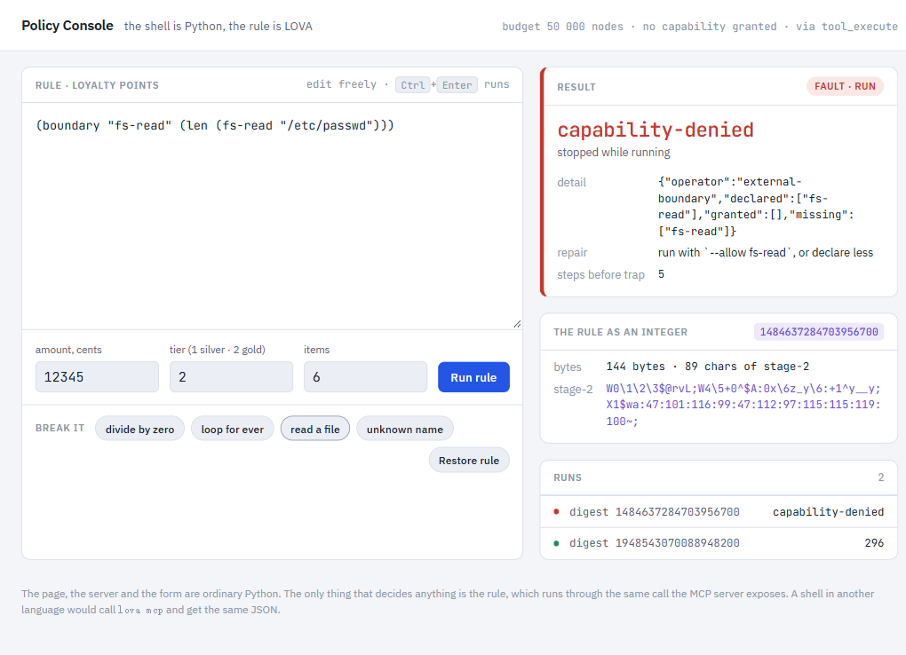

# LOVA — first programs

The first real LOVA programs.  Everything in `corpus/` and
`experiments/` is either benchmark input or test harness; the files
here are **LOVA code that exists to do something**, not to prove
LOVA exists.

## Running them

Since M11 there is a command line, so none of these needs its Python
driver any more:

```
python -m core.cli run apps/is_prime.lova 1999
python -m core.cli run apps/palindrome.lova racecar
python -m core.cli analyze apps/collatz.lova 27
python -m core.cli emit apps/coprime.lova 14 15 --form stage2
```

A `{placeholder}` in a program is filled positionally from the command
line; an argument that is not an integer is quoted as a string literal,
which is how `palindrome.lova racecar` works.  The `.py` drivers are
kept because each prints a little more of the pipeline than the CLI
does, but they are no longer the way in.

## Programs

### `is_perfect.lova`

Classify an integer as a number-theoretic *perfect* number
(σ(n) = 2n; examples 6, 28, 496, 8128).

```
(let 0 {n}
  (if-surprise
    (surprise
      (merge (ref 0) (ref 0))      ; predicted: 2n (if perfect)
      (sigma (ref 0)))             ; actual:    sigma(n)
    0                              ; non-zero surprise -> not perfect
    1))                            ; zero surprise     -> PERFECT
```

Run:

```
PYTHONPATH=. python apps/is_perfect.py 6     # -> 1 (perfect)
PYTHONPATH=. python apps/is_perfect.py 12    # -> 0 (not perfect, deviation=4)
PYTHONPATH=. python apps/is_perfect.py 28    # -> 1
PYTHONPATH=. python apps/is_perfect.py 496   # -> 1
```

### `coprime.lova`

Two integers are coprime iff their gcd is 1.  Shorter than
`is_perfect`; shows that `surprise` works as a general-purpose
equality check against any literal.

```
(if-surprise
  (surprise 1 (gcd {a} {b}))       ; |1 - gcd(a,b)|
  0                                ; non-zero surprise -> not coprime
  1)                               ; zero surprise     -> coprime
```

Run:

```
PYTHONPATH=. python apps/coprime.py 7 13     # -> 1 (coprime)
PYTHONPATH=. python apps/coprime.py 12 18    # -> 0 (not coprime, gcd=6)
```

### `is_prime.lova`

The first program here with an actual algorithm in it. Trial division
by recursion: walk a divisor upward until its square passes `n`.

```
(defn check [d n]
  (if-surprise (threshold (deviation (mul d d) n))
    1                                 ; d*d > n  -- no divisor, prime
    (if-surprise (mod n d)
      (check (merge d 1) n)           ; n mod d != 0  -- next d
      0)))                            ; d divides n   -- composite

(defn is-prime [n]
  (if-surprise (threshold (deviation 2 n)) 0 (check 2 n)))

(is-prime {n})
```

Run:

```
PYTHONPATH=. python apps/is_prime.py 97          # -> 1
PYTHONPATH=. python apps/is_prime.py 91          # -> 0 (7 x 13)
PYTHONPATH=. python apps/is_prime.py 561 1999    # Carmichael, then a prime
```

Note `(threshold (deviation a b))`: the core has no `<`. Ordering is
built from the surprise family — `deviation` is the signed sibling of
`surprise`, `threshold` is the sign test.

### `collatz.lova`

Counts Collatz steps to reach 1, carrying the counter as a second
curried parameter because LOVA has no mutable state and no pair type.

```
(defn next [n]
  (if-surprise (mod n 2) (merge (mul 3 n) 1) (partition n)))

(defn steps [n acc]
  (if-surprise (deviation n 1) (steps (next n) (merge acc 1)) acc))

(steps {n} 0)
```

Run:

```
PYTHONPATH=. python apps/collatz.py 27      # -> 111 steps
PYTHONPATH=. python apps/collatz.py 2463    # -> DepthTrap, not a crash
```

The second invocation is the point. Its trajectory is 208 steps, past
`MAX_CALL_DEPTH`, so the run ends in a structured anomaly naming the
limit, the overrun and what to do about it — the same schema as every
other LOVA trap. The Python equivalent raises `RecursionError` with a
stack trace an agent has to parse.

### `palindrome.lova`

The first program here that operates on **data** rather than on a
number.  Reverses a string and compares elementwise.

```
(def rev [xs acc]
  (if (nil? xs) acc (rev (tail xs) (cons (head xs) acc))))

(def same [a b]
  (if (nil? a) (nil? b)
    (if (nil? b) 0
      (if (dist (head a) (head b)) 0 (same (tail a) (tail b))))))

(def palindrome? [s] (same s (rev s (nil))))

(palindrome? {s})
```

Run:

```
PYTHONPATH=. python apps/palindrome.py racecar level abc
PYTHONPATH=. python apps/palindrome.py            # a default set
```

Three things it demonstrates:

- **A string is a list of codepoints.**  `"racecar"` is surface sugar
  for `(cons 114 (cons 97 ...))`, which is why the token table spends
  no slots at all on strings.
- **`dist` is `surprise`** — |a - b|, zero exactly when two codepoints
  match.  Equality never needed its own operator here.
- **The short spellings** (`if`, `dist`, `def`) are the one-token
  aliases Exp 13 measured: identical program, 30% fewer LLM tokens.

### `wordfreq.lova`

The M22 acceptance program: read a file under a declared boundary,
split it into words, count them in a map, sort, print the top n.  The
program that measured the interpreter's speed (journal M22, M23).

```
python -m core.cli run apps/wordfreq.lova notes.txt 10 --allow fs-read
```

### `tictactoe.lova`

Noughts and crosses against a memoised negamax.  The board is one
base-3 integer; the memo is a persistent map threaded through the
search as a value, because there is no other way to carry one.  You
are X; the computer never loses (20 random games under PyPy: 19 wins,
1 draw).  The argument is the board to start from, 0 for empty, so a
test can play an endgame instead of the first move's eleven-million-
step search.

```
python -m core.cli run apps/tictactoe.lova 0
printf '5\n1\n9\n' | python -m core.cli run apps/tictactoe.lova 0
```

### `guess.lova`

Guess the number.  The secret comes off the clock, under a boundary
the host has to grant; twelve lines, and two of the language's edges
found in writing them and closed the same day (Q78, Q79).

```
python -m core.cli run apps/guess.lova 100 --allow clock
```

### `logstats.lova`

A request log ("service status milliseconds" per line) summarised
per service: requests, mean and maximum latency, errors, most
requests first.  Read, parse, group in a map, aggregate, sort, print;
bad lines skipped.  Means are integers, because everything is.

```
python -m core.cli run apps/logstats.lova access.log --allow fs-read
```

### `ping.lova` / `pong.lova`

Two LOVA processes over UDP.  `pong` answers every datagram it
receives; `ping` sends k and prints the answers.  Each declares the
kind of effect (`net`); the host names the places:

```
python -m core.cli run apps/pong.lova 127.0.0.1:9002 --allow net=:9001,net=127.0.0.1:9002 &
python -m core.cli run apps/ping.lova 127.0.0.1:9001 3 --allow net=127.0.0.1:9001,net=:9002
```

### `sandbox.lova`

The agent scenario: untrusted programs, one per line of input, each
`read` into a value, run under a `budget`, and reported by hash and
value or by the name of its fault.  An infinite loop meets the
budget, a file read meets the boundary it did not declare, text that
is not a program is said to be one, and nothing reaches the sandbox,
which itself needs no grant.

```
python -m core.cli run apps/sandbox.lova 5000 < programs.txt
```

### `evolve.lova`

A function is a population (Axiom 6).  Five arithmetic programs are
seeded into a pool scored by distance from a target, evolved for k
generations with `lib/evolution.lova`, and the winner accounts for
itself from inside the language: its text, its value, its generation,
why it exists, how long its line of descent is.

```
python -m core.cli run apps/evolve.lova 42 60      # (mul (p 5) (tau 12)), distance 0
python -m core.cli run apps/evolve.lova 1000 200   # (merge (mul 33 30) 9) = 999
```

### `repair.lova`

Surprise is the debugger (Axiom 7).  A patient program violates a
`conserve` contract; the repairer mutates it, keeps a mutation only
if the surprise against the target shrinks, and stops at the first
version that satisfies the contract -- then prints the fix, the
attempts, its descent and its `why`.  Reproducible.

```
python -m core.cli run apps/repair.lova 42 30 200   # fixed in 39 attempts
```

### `batch.lova`

Conservation is declared in the program (Axiom 4).  300 Collatz jobs,
each under its own budget of nodes; the jobs that would cost more are
stopped, caught and counted, and the batch reports what finished.

```
python -m core.cli run apps/batch.lova 300 2000     # finished: 219, over budget: 81
```

### `shell/policy_app.py`

The division of labour LOVA is for, as a running application.  The
shell -- an HTTP server, a page, a form -- is ordinary Python, standard
library only.  The one thing that decides anything, a loyalty-points
rule, is a LOVA program you can edit in the browser.  The shell runs
it through the same call the MCP server exposes, under a budget of
50 000 nodes and with no capability granted, and shows what comes
back: the value, or the structured fault when you make the rule
divide by zero, loop for ever, read a file it never declared, or use a
name that does not exist.  The page also shows the rule as the integer
it is.  A shell in another language would call `lova mcp` and get the
same JSON.

```
python apps/shell/policy_app.py      # then open http://127.0.0.1:8765
```



## Arguments

A `{placeholder}` is filled from the command line in the order of
its first appearance in the code, or by name:

```
python -m core.cli run apps/batch.lova 300 2000
python -m core.cli run apps/batch.lova cost=2000 jobs=300
```

The newer programs declare their arguments first, so the order is
visible at the top of the file:

```
(def jobs [] {jobs})
(def cost [] {cost})
```

## Why these particular programs?

`is_perfect` and `coprime` use the four pieces that make LOVA actually
LOVA:

- **`let` / `ref`** — input binding (shows scope).
- **`merge`, `sigma`, `gcd`** — number-theoretic primitives as
  substrate operators.
- **`surprise`** — used as an *equality predicate* rather than a
  debugger.  The substrate records the comparison as a surprise
  event; the AI observer sees *why* the program decided.
- **`if-surprise`** — branching based on the surprise magnitude.

`is_perfect` in particular is **LOVA-idiomatic**: rather than
`if sigma(n) == 2*n`, it says *"hypothesise perfection; see how
surprised we are"*.  Identical outcome, different cognitive frame —
and the surprise trace is available to any AI post-hoc inspector.

## What's missing (so you know what these programs cannot do yet)

The list this section used to carry -- no output, no lists of lists,
no modules, no provenance from inside -- landed between M11 and M18.
What the twelve programs found in M23, and what became of it:

- **`stdin` keeps the line's terminator** (Q78, closed).  A blank
  line is `(10)`; only the end of the input is `nil`; `chomp` strips
  the newline when a program wants it gone.
- **`(def f [] body)` is a constant, not a thunk** (Q79, closed as a
  check).  It is evaluated once, where it is defined, so a recursive
  reference inside it is refused at compile time, by name.  A
  function that takes nothing has to take a dummy argument.
- **A boundary is lexical, and a region** (Q86, closed in M26).  A
  helper that uses an effect is written inside the boundary that
  declares it: `(boundary "clock" (def secret [n] ...) body)`.  The
  compiler still refuses an undeclared use before the run.
- **Records** (Q84, closed in M24): `(rec score s move k memo m)`
  and `(get st memo)` replaced the three-element lists
  `tictactoe.lova`'s search used to take apart by position.
- **Text is a value** (Q85, closed in M25): `words`, `split`, `join`
  and the rest are one operator each; the word count of 10 000 lines
  runs in 5.5 s on CPython where it took 28.
- **Speed.**  Solving the game is eleven million steps: 18 s on
  CPython, 3 s under PyPy.
- **`hash` is the program's integer, not a digest** (Q80, closed):
  150 digits for a program holding a short string.  `(digest p)` folds
  it to eighteen; `sandbox.lova` reports by it.
- **Arguments** (Q81, closed): `name=value` on the command line fills
  the placeholder it names, in any order.
- **`net-recv` yields the payload alone** (Q72): a server answers to
  an address it was given, not to whoever wrote.  Since M23 a send
  goes out from the listening socket when one is granted, so the peer
  at least sees a port to answer to.

`collatz.lova` still threads its counter through a curried parameter
rather than a pair -- worth rewriting now that a cons cell is a pair.

These are the first programs; they are intentionally narrow.  As
the language grows, the programs here will grow with it.
